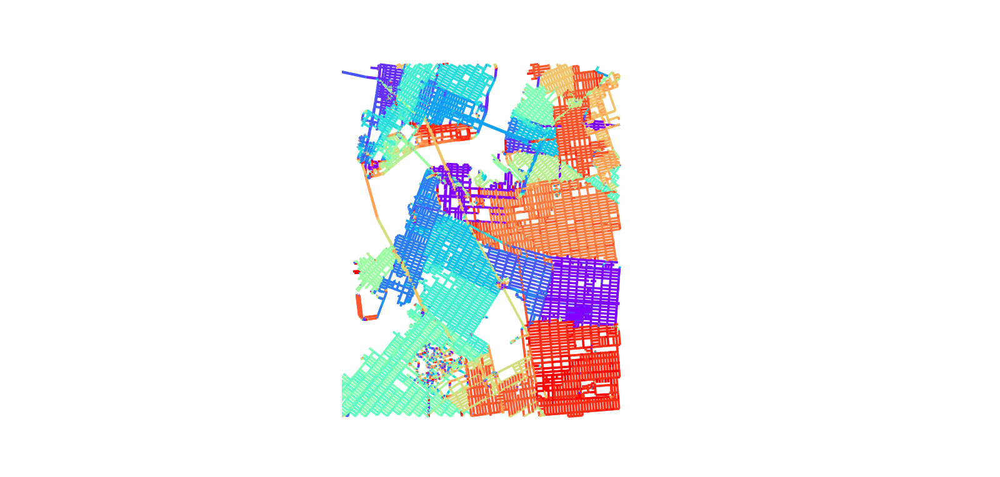

# osmnx-grid
Using osmnx to analyze the grids of New York City  
Can be modified for use on any city

PRs Welcome!

An example of the output:    
  

### Required Python Packages
* [OSMnx](https://github.com/gboeing/osmnx)

### Recommended
* [Anaconda](https://anaconda.org/anaconda/python)

### Instructions
1. If you haven't already, install OSMnx. See their [README](https://github.com/gboeing/osmnx) for detail installation instructions.
2. Run python `app.py`.
